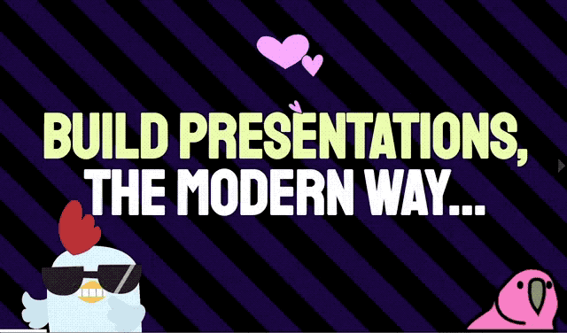

	

<h1 align="center">
	PRESENTA Lib
</h1>

	A javascript library to build expressive web presentations in seconds.

	
	
	

## Documentation

Full documentation can be found [here](https://lib.presenta.cc/).

## Contribute

### Development

To start a development session:

	npm start

To build a release:

	npm run build

## Licence

**PRESENTA Lib** is released under the [3-Clause BSD license](LICENSE).

Copyright © 2020 Fabio Franchino, [https://fabiofranchino.com](https://fabiofranchino.com)