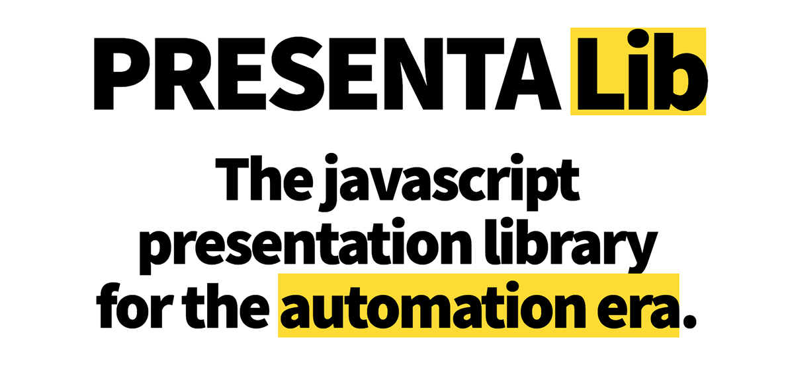

	
	
	
	

## Get started

- 📃 [Library documentation](https://lib.presenta.cc/)
- ⏯ [Basic examples](https://github.com/presenta-software/presenta-lib-examples)

## Templates

Custom templates can be created in two ways:

- Writing a JS configuration following the [library documentation](https://lib.presenta.cc/)
- Using our (upcoming) [visual editor and platform](https://www.presenta.cc/)

## Interact

Questions and suggestions: [Discussions board](https://github.com/presenta-software/presenta-lib/discussions).

Issues and bugs: [Issues section](https://github.com/presenta-software/presenta-lib/issues).

## Contribute

### Development

To start a development session:

	npm start

To build a release:

	npm run build

## Licence

**PRESENTA Lib** is released under the [3-Clause BSD license](LICENSE).

Copyright © 2020-21 Fabio Franchino, [https://www.fabiofranchino.com](fabiofranchino.com)